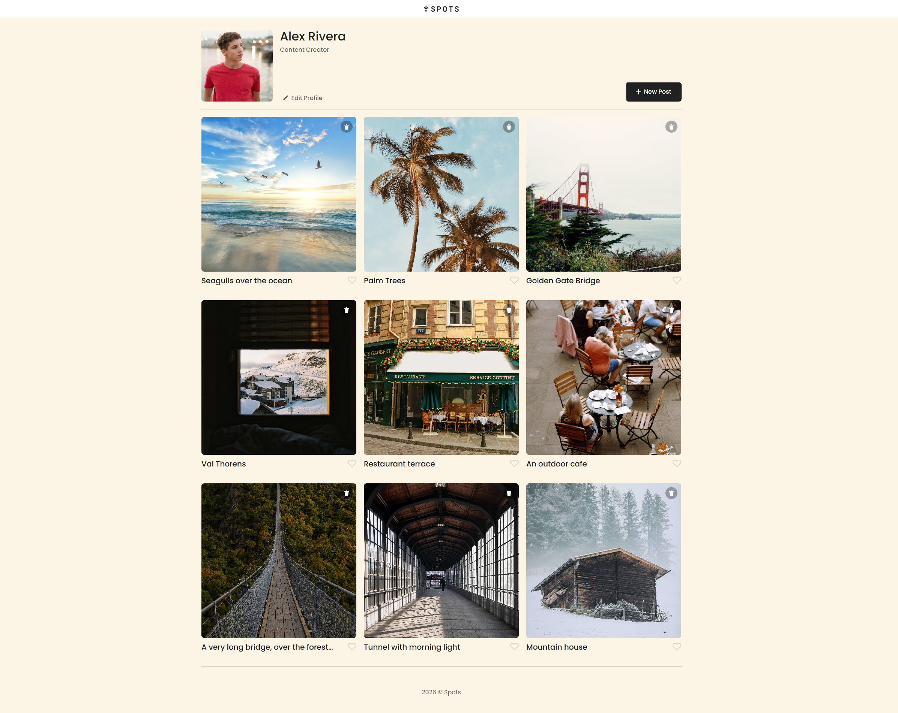
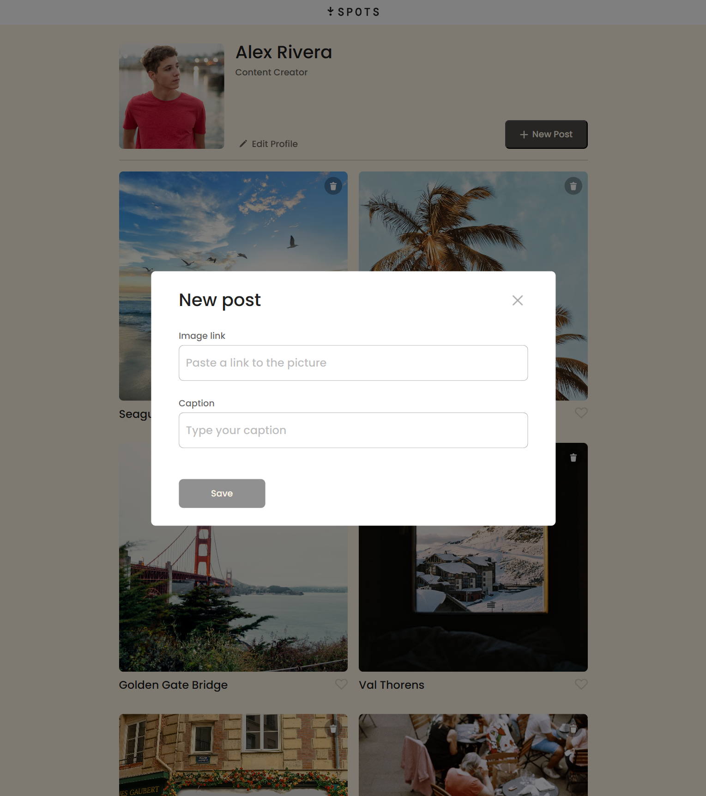
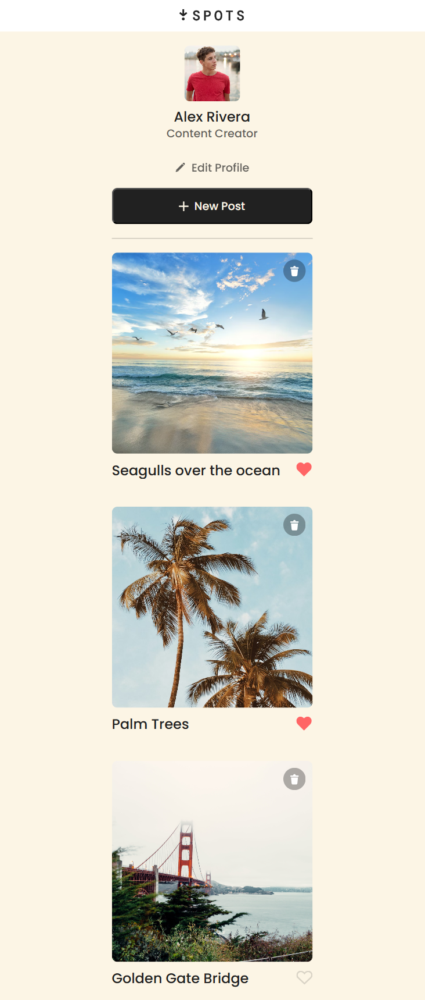

# Spots

This project is a responsive profile page built with semantic HTML and CSS using the BEM methodology and file structure.
It includes interactive features implemented with JavaScript such as form validation, modal interactions, and dynamic card creation.

## Project Structure

The webpage consists of two main sections:

**Profile**

- Displays the avatar, username, description, and action buttons.

- Fully responsive across desktop, tablet, and mobile.

- Text elements are truncated according to the project requirements.

**Cards**

- A grid of image cards that resize and reorganize depending on the screen width.

- Text below each card is truncated to one line.

## Responsive Design

- The layout adapts at the following breakpoints:

- Desktop: 1440px design (max-width: 1280px container)

- Tablet: max-width 1280px

- Mobile: max-width 627px

## Project features

- Semantic HTML5
- CSS Flexbox and Grid
- Responsive media queries
- BEM file structure
- Interactive hover states
- JavaScript form validation
- DOM manipulation with event listeners

## Project Overview

### Desktop View

### Tablet View & Modal Open

### Mobile View

## Figma

[Link to the project on Figma](https://www.figma.com/file/BBNm2bC3lj8QQMHlnqRsga/Sprint-3-Project-%E2%80%94-Spots?type=design&node-id=2%3A60&mode=design&t=afgNFybdorZO6cQo-1)

## GitHub Page

https://iliascka.github.io/se_project_spots/

## Project Video

[Project video](https://www.loom.com/share/b2106e687ba4430e9a61d744241e3e8f)
